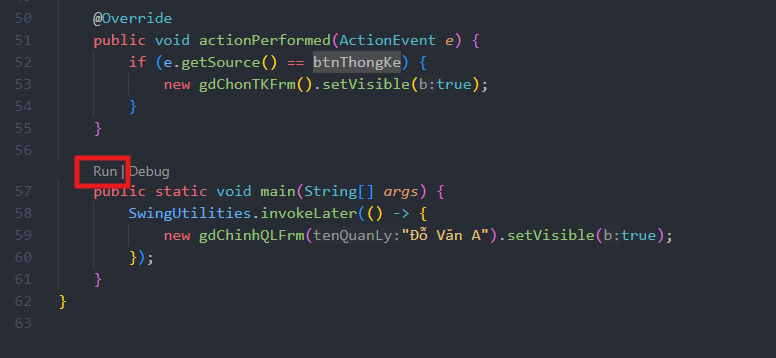
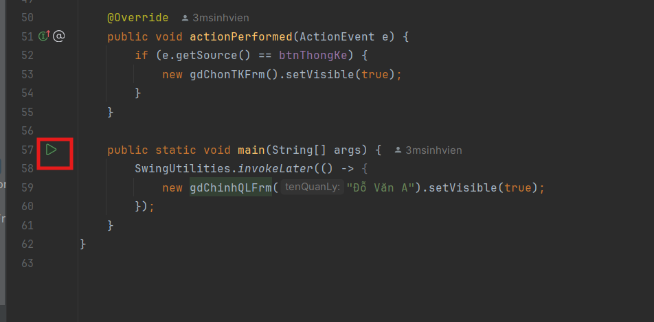

# Hướng dẫn cài đặt và chạy chương trình Quản Lý Trả Góp

## Yêu cầu hệ thống
- Java Development Kit (JDK) 8 trở lên
- MySQL Server 5.7 trở lên

## Các bước cài đặt

### 1. Cài đặt cơ sở dữ liệu

1. Mở MySQL Command Line Client hoặc MySQL Workbench
2. Tạo database mới bằng lệnh:
```sql
CREATE DATABASE tragop;
```
3. Chạy script SQL để tạo bảng và dữ liệu mẫu:
   - Mở file `add_data.sql` trong thư mục gốc của project
   - Copy toàn bộ nội dung và chạy trong MySQL
   - Hoặc sử dụng lệnh source trong MySQL:
```sql
source đường_dẫn_tới_file/add_data.sql
```

### 2. Cấu hình kết nối database

1. Mở project trong NetBeans
2. Tìm file cấu hình kết nối database trong thư mục `src/dao`
3. Cập nhật thông tin kết nối:
   - Username MySQL
   - Password MySQL
   - URL kết nối (mặc định: `jdbc:mysql://localhost:3306/tragop`)

### 3. Chạy chương trình

#### Nên sử dụng Intelij hoặc VSCode đã cài Java Package Extention
1. Mở project IDE của anh em
2. Mở file /view/gdChinhQLFrm
3. Run hàm main
   
   


## Cấu trúc thư mục
```
QuanLyTraGop/
├── lib/                    # Thư viện dependencies
├── src/
│   ├── dao/               # Data Access Objects
│   ├── model/             # Model classes
│   └── view/              # Giao diện người dùng
├── add_data.sql           # Script tạo database
└── run-test.bat           # File chạy chương trình
```

## Lưu ý
- Đảm bảo MySQL Server đang chạy trước khi khởi động chương trình
- Kiểm tra kết nối database nếu gặp lỗi
- Đảm bảo đã cài đặt đầy đủ các thư viện trong thư mục `lib/`

 